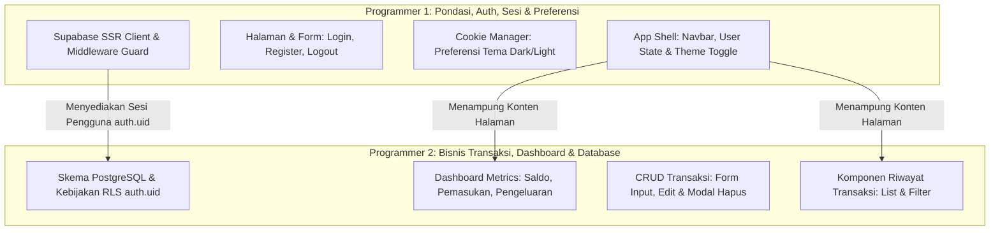

# Dokumen Pembagian Tugas & Spesifikasi Kerja (SRS Division)
## Proyek: DUITku — Expense Tracker Mahasiswa
**Referensi Dokumen:** [SRS_DUITku.md](file:///c:/Pratikum%20PPK%202/SRS_DUITku.md)  
**Model Kolaborasi:** 2 Fullstack Developers (Programmer 1 & Programmer 2)  
**Target Rilis:** Aplikasi Siap Uji & Terintegrasi Penuh  

---

## 1. Strategi Pembagian & Arsitektur Kolaborasi

Untuk memaksimalkan produktivitas dan **mencegah konflik Git (*merge conflict*)**, pembagian tugas dilakukan menggunakan pola **Vertical Slice & Domain Separation**:



- **Programmer 1** bertanggung jawab atas **Pintu Masuk & Keamanan Aplikasi (Auth, Session, Route Guard, Preferensi Cookie Tema, dan Shell UI)**.
- **Programmer 2** bertanggung jawab atas **Logika Inti Finansial (Skema Database PostgreSQL RLS, Agregasi Dashboard, dan CRUD Transaksi)**.

---

## 2. Matriks Alokasi Kebutuhan (FR & NFR)

| Kode Kebutuhan | Nama Kebutuhan | Penanggung Jawab | Deskripsi Tanggung Jawab |
| :--- | :--- | :---: | :--- |
| **FR-01** | Registrasi Akun Mahasiswa | **Programmer 1** | Halaman `/register`, validasi input, registrasi Supabase Auth. |
| **FR-02** | Login & Sesi Pengguna | **Programmer 1** | Halaman `/login`, otentikasi Supabase, pembentukan session cookie. |
| **FR-03** | Dashboard Ringkasan Finansial | **Programmer 2** | Kartu ringkasan: Saldo Bersih, Total Inflow, Total Outflow. |
| **FR-04** | Tambah Transaksi Baru | **Programmer 2** | Form transaksi (Pemasukan/Pengeluaran), Server Action insert. |
| **FR-05** | Lihat Riwayat Transaksi | **Programmer 2** | Tabel/daftar riwayat transaksi terurut tanggal terbaru. |
| **FR-06** | Ubah Transaksi (*Edit*) | **Programmer 2** | Dialog/halaman edit transaksi yang sudah ada. |
| **FR-07** | Hapus Transaksi (*Delete*) | **Programmer 2** | Aksi delete transaksi beserta dialog konfirmasi. |
| **FR-08** | Preferensi Tema (Cookie) | **Programmer 1** | Manajemen cookie `duitku_theme` (Dark/Light) & integrasi CSS. |
| **FR-09** | Logout Pengguna | **Programmer 1** | Server Action logout & pembersihan cookie sesi. |
| **NFR-01** | Data Isolation via RLS | **Programmer 2** | Script DDL tabel `transactions` & RLS `auth.uid() = user_id`. |
| **NFR-02** | Session Persistence & Guard | **Programmer 1** | Next.js `middleware.ts` untuk proteksi rute publik vs privat. |
| **NFR-03** | Cookie Compliance | **Programmer 1** | Pengaturan atribut cookie (`Path`, `SameSite`, `Max-Age`). |
| **NFR-04** | Usability & Antarmuka Bersih | **Bersama (P1 & P2)** | Konsistensi UI menggunakan Tailwind CSS v4 & responsif. |

---

## 3. Spesifikasi Rinci: PROGRAMMER 1

### 3.1 Fokus Area: Otentikasi, Manajemen Sesi, Route Guard & Cookie Preferensi
Programmer 1 memastikan aplikasi memiliki gerbang akses yang aman, sesi tidak terputus, rute terlindungi, preferensi tema tersimpan via cookie, dan kerangka tampilan (*layout*) siap digunakan.

### 3.2 Berkas yang Dibuat / Dikelola oleh Programmer 1:
```
src/
├── middleware.ts                         <-- Proteksi rute (/dashboard vs /login)
├── lib/
│   ├── supabase/
│   │   ├── client.ts                     <-- Browser Supabase Client
│   │   ├── server.ts                     <-- Server Supabase Client (@supabase/ssr)
│   │   └── middleware.ts                 <-- Session update helper untuk middleware
│   └── cookies.ts                        <-- Helper get/set cookie preferensi tema
├── app/
│   ├── (auth)/
│   │   ├── login/page.tsx                <-- Halaman login
│   │   └── register/page.tsx             <-- Halaman registrasi
│   ├── auth/
│   │   └── actions.ts                    <-- Server Actions: login, register, logout
│   └── layout.tsx                        <-- Root layout: pasang tema awal dari cookie
└── components/
    ├── Navbar.tsx                        <-- Header: Logo, Email User, Logout Button
    └── ThemeToggle.tsx                   <-- Tombol ganti tema (Light/Dark) via cookie
```

### 3.3 Rincian Tugas Programmer 1:
1. **Setup Helper Supabase SSR**:
   - Konfigurasi `@supabase/ssr` untuk client, server component, dan middleware.
2. **Implementasi Route Guard (`middleware.ts`)**:
   - Jika pengguna belum login dan mengakses `/dashboard`, arahkan ke `/login`.
   - Jika pengguna sudah login dan mengakses `/login` atau `/register`, arahkan ke `/dashboard`.
3. **Formulir & Autentikasi (`/login` & `/register`)**:
   - Validasi email mahasiswa dan panjang password minimal 6 karakter.
   - Tangani error (email duplikat, password salah, dsb.) dengan pesan yang jelas.
4. **Fitur Logout**:
   - Menghapus sesi Supabase dan mengarahkan kembali ke `/login`.
5. **Preferensi Pengguna via Cookie (`FR-08`)**:
   - Implementasikan fungsi baca/tulis cookie `duitku_theme` (`light` | `dark`).
   - Sediakan tombol ganti tema (*toggle*) pada komponen `ThemeToggle.tsx`.
   - Pastikan tema aktif diinject pada tag `<html>` atau `<body>` di `layout.tsx` agar tidak terjadi *flickering* saat reload.

### 3.4 Kriteria Selesai (*Definition of Done*) Programmer 1:
- [ ] Pengguna dapat mendaftar akun baru dan langsung login.
- [ ] Pengguna yang belum login dicegah masuk ke `/dashboard`.
- [ ] Pengguna yang sudah login tetap bertahan sesinya saat tab/browser di-refresh.
- [ ] Mengubah tema (Dark/Light) berhasil menyimpan cookie `duitku_theme` dan bertahan setelah halaman di-reload.
- [ ] Tombol logout berhasil mengeluarkan sesi pengguna.

---

## 4. Spesifikasi Rinci: PROGRAMMER 2

### 4.1 Fokus Area: Skema Database, Isolasi Data (RLS), Dashboard & CRUD Transaksi
Programmer 2 memastikan data transaksi tersimpan dengan aman di PostgreSQL, hanya bisa diakses oleh pemiliknya, serta menghitung dan menyajikan data finansial secara akurat.

### 4.2 Berkas yang Dibuat / Dikelola oleh Programmer 2:
```
scripts/
└── schema.sql                            <-- DDL tabel transactions + RLS policies
src/
├── types/
│   └── transaction.ts                    <-- Interface TypeScript Transaksi & Summary
├── app/
│   └── (dashboard)/
│       ├── dashboard/page.tsx            <-- Halaman dashboard utama
│       └── transactions/actions.ts       <-- Server Actions: CRUD transaksi & rekap
└── components/
    ├── dashboard/
    │   ├── SummaryCards.tsx              <-- Kartu: Saldo, Pemasukan, Pengeluaran
    │   └── TransactionList.tsx           <-- Tabel/Daftar Riwayat Transaksi
    └── transactions/
        ├── TransactionFormModal.tsx      <-- Modal form Tambah & Edit Transaksi
        └── DeleteConfirmModal.tsx        <-- Dialog konfirmasi hapus transaksi
```

### 4.3 Rincian Tugas Programmer 2:
1. **Desain Skema Database & RLS (`scripts/schema.sql`)**:
   - Buat tabel `transactions`:
     - `id`: UUID (Primary Key, default `gen_random_uuid()`)
     - `user_id`: UUID (Foreign Key ke `auth.users(id)`, Not Null)
     - `type`: TEXT / VARCHAR (Check: `'income'` ATAU `'expense'`)
     - `amount`: NUMERIC / BIGINT (Nominal > 0)
     - `category`: TEXT (Misal: Makan, Uang Saku, Transport, Kos, Kuliah, Hiburan)
     - `date`: DATE (Tanggal transaksi)
     - `notes`: TEXT (Catatan opsional)
     - `created_at`: TIMESTAMPTZ (Default `now()`)
   - **Terapkan Kebijakan RLS (NFR-01)**:
     ```sql
     ALTER TABLE public.transactions ENABLE ROW LEVEL SECURITY;

     CREATE POLICY "User dapat mengelola transaksinya sendiri"
     ON public.transactions
     FOR ALL
     TO authenticated
     USING (auth.uid() = user_id)
     WITH CHECK (auth.uid() = user_id);
     ```
2. **Kalkulasi Metrik Dashboard (`FR-03`)**:
   - Buat fungsi query ringkasan:
     - `Total Pemasukan`: `SUM(amount) WHERE type = 'income'`
     - `Total Pengeluaran`: `SUM(amount) WHERE type = 'expense'`
     - `Saldo Saat Ini`: `Total Pemasukan - Total Pengeluaran`
   - Render ke dalam 3 kartu ringkasan visual yang kontras dan mudah dibaca.
3. **Pencatatan & Riwayat Transaksi (`FR-04 & FR-05`)**:
   - Form input transaksi dengan pilihan jenis (*Income* / *Expense*), nominal, kategori, tanggal, dan catatan.
   - Daftar riwayat transaksi terurut tanggal terbaru (`ORDER BY date DESC, created_at DESC`).
   - Format nominal menggunakan standar Rupiah (contoh: `Rp 50.000`).
4. **Operasi Edit & Hapus Transaksi (`FR-06 & FR-07`)**:
   - Fitur edit: mengambil data transaksi terpilih ke dalam modal form dan memperbaruinya.
   - Fitur hapus: dialog konfirmasi "Apakah Anda yakin ingin menghapus transaksi ini?", dilanjutkan penghapusan data.

### 4.4 Kriteria Selesai (*Definition of Done*) Programmer 2:
- [ ] Tabel `transactions` dan RLS aktif di Supabase.
- [ ] Pengguna A **tidak dapat** melihat, mengedit, atau menghapus transaksi milik Pengguna B (*Data Isolation teruji*).
- [ ] Berhasil menambah, melihat, mengedit, dan menghapus transaksi.
- [ ] Kartu Saldo, Total Pemasukan, dan Total Pengeluaran terhitung akurat sesuai riwayat transaksi.
- [ ] Format nominal mata uang rapi dan informatif (misal: warna hijau untuk pemasukan, merah untuk pengeluaran).

---

## 5. Kontrak Titik Integrasi (*Interface Contract*) Antar Programmer

Agar integrasi berjalan mulus tanpa saling menunggu, kedua programmer menyepakati kontrak berikut:

### 5.1 Kontrak Sesi & Identitas Pengguna (P1 ➔ P2)
Programmer 2 tidak perlu khawatir mengenai cara login dilakukan. Programmer 2 cukup memanggil Supabase client server di dalam Server Component/Server Action:
```typescript
// Cara Programmer 2 mengambil user_id aktif:
const supabase = await createClient();
const { data: { user } } = await supabase.auth.getUser();
// user.id otomatis tersedia dan divalidasi oleh RLS
```

### 5.2 Kontrak Struktur Data Transaksi (Shared Types)
Dibuat di `src/types/transaction.ts` agar kedua programmer sepakat pada struktur data:
```typescript
export type TransactionType = 'income' | 'expense';

export interface Transaction {
  id: string;
  user_id: string;
  type: TransactionType;
  amount: number;
  category: string;
  date: string;
  notes?: string;
  created_at: string;
}

export interface FinancialSummary {
  balance: number;
  totalIncome: number;
  totalExpense: number;
}
```

### 5.3 Kontrak Layout Antarmuka (P1 ➔ P2)
Programmer 1 menyediakan layout utama (`Navbar` dengan tombol Logout dan Theme Toggle). Programmer 2 meletakkan komponen `SummaryCards` dan `TransactionList` tepat di dalam area konten utama:
```tsx
// src/app/(dashboard)/layout.tsx (Disediakan P1)
export default function DashboardLayout({ children }: { children: React.ReactNode }) {
  return (
    <div className="min-h-screen bg-background text-foreground">
      <Navbar />
      <main className="max-w-5xl mx-auto p-4 md:p-6">{children}</main>
    </div>
  );
}
```

---

## 6. Alur Kerja Git & Panduan Penggabungan (*Git Workflow*)

Untuk menghindari konflik kode di branch `main`:

1. **Pembuatan Branch Fitur**:
   - Programmer 1 bekerja di branch: `git checkout -b feature/auth-session-theme`
   - Programmer 2 bekerja di branch: `git checkout -b feature/database-transaction-crud`
2. **Commit Mandiri & Rapi**:
   - Lakukan commit berkala dengan pesan deskriptif.
3. **Sinkronisasi & Integrasi**:
   - **Langkah 1**: Programmer 1 menyelesaikan pondasi helper Supabase, types, dan layout, lalu me-merge ke `main`.
   - **Langkah 2**: Programmer 2 melakukan `git pull origin main` ke dalam branch-nya untuk mendapatkan helper dan layout terbaru.
   - **Langkah 3**: Programmer 2 memasang fitur transaksi ke dalam dashboard, menguji, dan me-merge ke `main`.
4. **Pengujian Bersama (Final Acceptance Test)**:
   - Uji skenario multi-user (buat Akun A dan Akun B pada browser berbeda/incognito).
   - Pastikan Akun A tidak melihat transaksi Akun B.
   - Pastikan tema tersimpan pada cookie saat browser ditutup.
