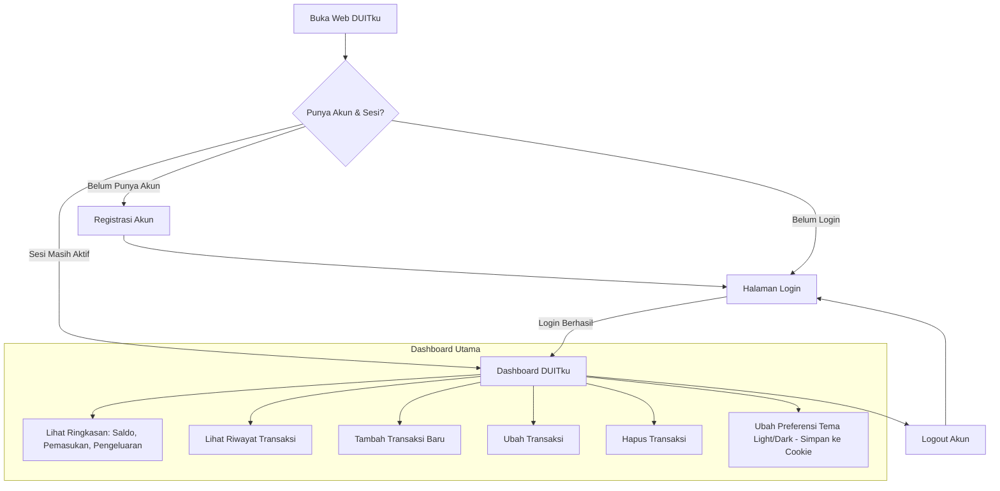

# Spesifikasi Kebutuhan Perangkat Lunak (SRS)
## Proyek: DUITku — Expense Tracker Mahasiswa
**Versi Dokumen:** 1.1.0 (Ringkas & Tepat Sasaran)  
**Status:** Disetujui untuk Implementasi  

---

## 1. Pendahuluan & Tujuan
Dokumen ini menetapkan spesifikasi kebutuhan sistem untuk **DUITku**, sebuah aplikasi web *Expense Tracker* sederhana yang dirancang khusus bagi mahasiswa untuk mengelola dan memantau arus kas pribadi (pemasukan dan pengeluaran).

Aplikasi berfokus pada:
- Kemudahan pencatatan transaksi harian.
- Kejelasan ringkasan kondisi finansial (Saldo, Pemasukan, Pengeluaran).
- Keamanan data pribadi antar-mahasiswa (*Data Isolation*).
- Retensi sesi login dan penyimpanan preferensi pengguna via *Cookies*.

---

## 2. Aktor & Arsitektur Teknologi
### 2.1 Aktor Sistem
- **Mahasiswa (Pengguna)**: Melakukan registrasi, login/logout, mencatat, melihat, menyunting, dan menghapus transaksi miliknya sendiri, serta mengatur preferensi tema.

### 2.2 Arsitektur & Ketergantungan Teknologi
- **Frontend & Fullstack Framework**: Next.js 16 (App Router), React 19, TypeScript.
- **Styling**: Tailwind CSS v4 (tampilan bersih, sederhana, responsif ponsel & desktop).
- **Backend & Database**: Supabase (PostgreSQL) dengan *Row Level Security* (RLS).
- **Session & Cookie**:
  - *Auth Session*: Dikelola aman oleh `@supabase/ssr` via HTTP-Only Secure Cookie.
  - *User Preference*: Cookie peramban (`duitku_theme`) untuk preferensi tema (*Dark/Light Mode*).

---

## 3. Matriks Kebutuhan Fungsional (Functional Requirements)

| Kode | Kebutuhan | Deskripsi | Prioritas |
| :--- | :--- | :--- | :--- |
| **FR-01** | **Registrasi Akun** | Pengguna dapat membuat akun baru menggunakan email dan password. | Wajib (*Must*) |
| **FR-02** | **Login & Sesi** | Pengguna dapat masuk ke akun. Sesi login dipertahankan selama masa aktif sesi berlaku. | Wajib (*Must*) |
| **FR-03** | **Dashboard Ringkasan** | Menampilkan 3 metrik utama secara jelas di dashboard: 1. **Saldo Saat Ini** (Total Pemasukan - Total Pengeluaran) 2. **Total Pemasukan** 3. **Total Pengeluaran** | Wajib (*Must*) |
| **FR-04** | **Tambah Transaksi** | Pengguna dapat menambahkan transaksi baru dengan memilih tipe (**Pemasukan** atau **Pengeluaran**), memasukkan nominal, kategori, tanggal, dan catatan opsional. | Wajib (*Must*) |
| **FR-05** | **Lihat Riwayat Transaksi** | Pengguna dapat melihat daftar seluruh transaksi miliknya di dashboard terurut dari tanggal terbaru. | Wajib (*Must*) |
| **FR-06** | **Ubah Transaksi (Edit)** | Pengguna dapat memperbarui rincian transaksi (nominal, jenis, kategori, tanggal, catatan) yang telah dibuat sebelumnya. | Wajib (*Must*) |
| **FR-07** | **Hapus Transaksi (Delete)** | Pengguna dapat menghapus data transaksi dengan konfirmasi dialog untuk mencegah ketidaksengajaan. | Wajib (*Must*) |
| **FR-08** | **Preferensi Cookie (Tema)** | Aplikasi menyimpan preferensi tema antarmuka (*Light Mode* / *Dark Mode*) ke dalam browser cookie sehingga preferensi tetap terjaga saat browser ditutup/dimuat ulang. | Wajib (*Must*) |
| **FR-09** | **Logout Pengguna** | Pengguna dapat keluar dari akun dan membersihkan sesi aktif saat ini. | Wajib (*Must*) |

---

## 4. Matriks Kebutuhan Non-Fungsional (Non-Functional Requirements)

| Kode | Kategori | Spesifikasi & Batasan Teknis |
| :--- | :--- | :--- |
| **NFR-01** | **Data Isolation (Isolasi Data)** | - Setiap data transaksi wajib terhubung dengan `user_id` dari pengguna yang sedang login. - Menerapkan aturan PostgreSQL *Row Level Security* (RLS): pengguna **hanya dapat melihat dan memanipulasi data miliknya sendiri**. - Pengguna lain tidak memiliki hak akses baca/tulis terhadap data transaksi mahasiswa lain. |
| **NFR-02** | **Session Management** | - Sesi login pengguna disimpan pada cookie berbasis *HttpOnly* dan *SameSite=Lax*. - Akses ke rute privat (dashboard & transaksi) otomatis dicek via middleware; pengguna tanpa sesi dialihkan ke halaman login. |
| **NFR-03** | **Cookie Compliance** | - Preferensi tema disimpan dengan nama cookie `duitku_theme` dengan masa kedaluwarsa 365 hari. - Server membaca cookie tema pada saat initial SSR render untuk mencegah *flash of wrong theme*. |
| **NFR-04** | **Usability & Sederhana** | - Desain antarmuka bersih (*clean*), minim distraksi, dan mudah dipahami oleh mahasiswa. - Form input transaksi cepat dan responsif pada layar ponsel pintar (360px ke atas). |

---

## 5. Ringkasan Alur Pengguna (User Flow)

