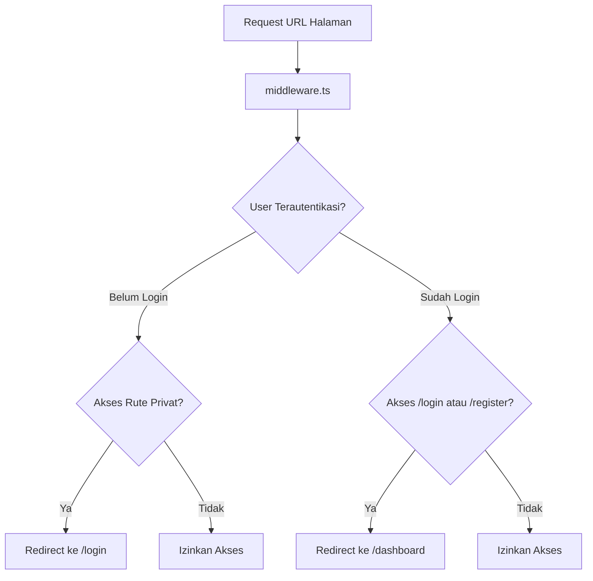
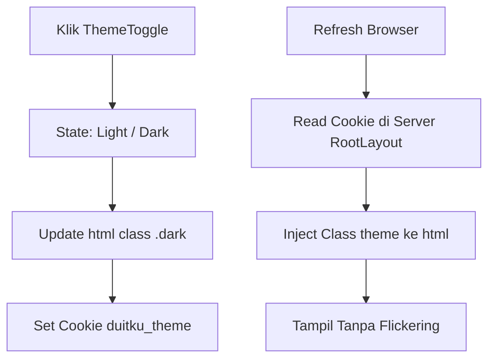

# Dokumen Flowchart & Arsitektur Alur Kerja (Programmer 1)
## Proyek: DUITku — Expense Tracker Mahasiswa

Dokumen ini berisi diagram alur kerja (*flowchart*) dalam bentuk **Kotak Teks & Panah** serta **Mermaid Diagram** untuk seluruh fitur yang dikerjakan oleh **Programmer 1** (Autentikasi Supabase SSR, Route Guard Middleware, Manajemen Sesi, Cookie Preferensi Tema, dan Navbar).

---

## 1. Flowchart Alur Autentikasi & Registrasi Pengguna

### A. Diagram Kotak & Panah (Text Box Diagram)

```text
====================================================================================================
                                 ALUR AUTENTIKASI & REGISTRASI PENGGUNA
====================================================================================================

                     +---------------------------------------+
                     |       Pengguna Membuka Aplikasi       |
                     +---------------------------------------+
                                         |
                                         v
                     +---------------------------------------+
                     |    Apakah Pengguna Sudah Login?       |
                     +---------------------------------------+
                               /                   \
                        (Ya)  /                     \ (Tidak)
                             v                       v
               +---------------------------+   +---------------------------+
               |  Masuk ke /dashboard      |   |   Akses Halaman /login    |
               +---------------------------+   +---------------------------+
                             |                               |
                             | (Klik Logout)                 v
                             v                 +---------------------------+
               +---------------------------+   |     Pilih Aksi Pengguna   |
               |  Hapus Sesi & Redirect    |   +---------------------------+
               |        ke /login          |                 /           \
               +---------------------------+   (Daftar Akun)/             \(Masuk Akun)
                                                           v               v
                                            +-------------------+   +-------------------+
                                            | Halaman /register |   |  Input Email &    |
                                            +-------------------+   |     Password      |
                                                      |             +-------------------+
                                                      v                       |
                                            +-------------------+             v
                                            | Validasi Input:   |   +-------------------+
                                            | - Password >= 6   |   | Supabase Auth     |
                                            | - Match Confirm   |   | signInWithPassword|
                                            +-------------------+   +-------------------+
                                              /               \               |
                                     (Gagal) /                 \ (Sukses)     v
                                            v                   v   +-------------------+
                                    +---------------+   +-------+   | Evaluasi Hasil    |
                                    | Pesan Error   |   | SignUp|   | Login             |
                                    | Validasi Form |   | Action|   +-------------------+
                                    +---------------+   +-------+     /       |       \
                                                            |        /        |        \
                                                            v       /         |         \
                                                    +---------------+   +-----------+  +---------------+
                                                    | Cek Email     |   | Email     |  | Password      |
                                                    | Duplikat      |   | Belum     |  | Salah:        |
                                                    +---------------+   | Terdaftar:|  | "pwnya salah  |
                                                      /           \     | "Email    |  |  bos"         |
                                             (Ya)    /             \    |  belum    |  +---------------+
                                                    v               v   |  terdaftar|
                                            +---------------+   +---+   +-----------+
                                            | Pesan Error:  |   |Suk|
                                            | "Email sudah  |   |ses|
                                            |  terdaftar"   |   +---+
                                            +---------------+     |
                                                                  v
                                                        +-------------------+
                                                        | Masuk /dashboard  |
                                                        +-------------------+
```

### B. Diagram Mermaid Visual

```mermaid
flowchart TD
    Start([Mulai: Buka Aplikasi]) --> CheckSession{Sudah Login?}
    
    CheckSession -- Ya --> Dashboard[/dashboard]
    Dashboard -- Klik Keluar --> Logout[Hapus Sesi] --> Login[/login]
    
    CheckSession -- Tidak --> Login
    Login --> Choice{Pilih Aksi}
    
    Choice -- Register --> Reg[/register] --> InputReg[Input Form]
    InputReg --> ValidReg{Valid?}
    ValidReg -- Tidak --> ErrValid[Error Validasi Form] --> Reg
    ValidReg -- Ya --> ActionReg[Action: signup]
    ActionReg --> CheckDup{Email Duplikat?}
    CheckDup -- Ya --> ErrDup[Error: Email sudah terdaftar] --> Reg
    CheckDup -- Tidak --> Dashboard
    
    Choice -- Login --> InputLogin[Input Form] --> ActionLogin[Action: login]
    ActionLogin --> CheckAuth{Status Login}
    CheckAuth -- Email Belum Terdaftar --> ErrEmail[Error: Email belum terdaftar] --> Login
    CheckAuth -- Password Salah --> ErrPass[Error: pwnya salah bos] --> Login
    CheckAuth -- Sukses --> Dashboard
```

---

## 2. Flowchart Route Guard (Middleware Protection)

### A. Diagram Kotak & Panah (Text Box Diagram)

```text
====================================================================================================
                               ALUR MITIGASI & PROTEKSI ROUTE GUARD
====================================================================================================

                     +---------------------------------------+
                     |   Request Rute Halaman dari Browser   |
                     +---------------------------------------+
                                         |
                                         v
                     +---------------------------------------+
                     |        middleware.ts Dijalankan       |
                     |  Periksa Sesi via Supabase SSR Client |
                     +---------------------------------------+
                                         |
                                         v
                     +---------------------------------------+
                     |    Apakah Pengguna Terautentikasi?    |
                     +---------------------------------------+
                               /                   \
                        (Tidak)/                     \(Ya)
                              v                       v
               +---------------------------+   +---------------------------+
               |  Akses Rute Privat?       |   |  Akses Rute Auth?         |
               |  (/dashboard)             |   |  (/login atau /register)  |
               +---------------------------+   +---------------------------+
                        /         \                     /         \
                 (Ya)  /           \ (Tidak)     (Ya)  /           \ (Tidak)
                      v             v                 v             v
         +------------------+ +-----------+   +------------------+ +-----------+
         | Redirect Ke      | | Izinkan   |   | Redirect Ke      | | Izinkan   |
         | /login           | | Akses     |   | /dashboard       | | Akses     |
         +------------------+ +-----------+   +------------------+ +-----------+
```

### B. Diagram Mermaid Visual



---

## 3. Flowchart Preferensi Tema (Cookie `duitku_theme`)

### A. Diagram Kotak & Panah (Text Box Diagram)

```text
====================================================================================================
                             ALUR PREFERENSI TEMA COOKIE & ANTI-FLICKERING
====================================================================================================

 [User Klik ThemeToggle]                             [User Refresh / Buka Kembali Halaman]
            |                                                           |
            v                                                           v
+-----------------------+                                   +-----------------------+
|  Toggle State Tema    |                                   | RootLayout Next.js    |
|   (Light <-> Dark)    |                                   | Membaca Cookie Server |
+-----------------------+                                   | 'duitku_theme'        |
            |                                               +-----------------------+
            v                                                           |
+-----------------------+                                               v
| Ubah DOM Class        |                                   +-----------------------+
| html.classList(.dark) |                                   | Inject Class Theme    |
+-----------------------+                                   | Ke Tag <html> Server  |
            |                                               +-----------------------+
            v                                                           |
+-----------------------+                                               v
| Simpan Ke Cookie      |                                   +-----------------------+
| 'duitku_theme'        |                                   | Halaman Tampil Tanpa  |
| Max-Age 1 Tahun       |                                   | Flickering (Kedipan)  |
+-----------------------+                                   +-----------------------+
```

### B. Diagram Mermaid Visual



---

## 4. Matriks Ringkasan Berkas Programmer 1

```text
+------------------------------------+---------------------------------------------------------------+
| Nama Berkas                        | Tanggung Jawab Utama                                          |
+------------------------------------+---------------------------------------------------------------+
| src/middleware.ts                  | Middleware utama pemblokir/pengalih rute privat & auth        |
| src/lib/supabase/client.ts         | Inisialisasi Supabase Browser Client                          |
| src/lib/supabase/server.ts         | Inisialisasi Supabase Server Client (@supabase/ssr)           |
| src/lib/supabase/middleware.ts     | Helper session update & route guard                           |
| src/lib/cookies.ts                 | Utility baca/tulis cookie preferensi duitku_theme             |
| src/app/auth/actions.ts            | Server actions login, signup, dan logout                      |
| src/app/(auth)/login/page.tsx      | Form Login Mahasiswa dengan notifikasi error kustom           |
| src/app/(auth)/register/page.tsx   | Form Registrasi Mahasiswa dengan validasi kata sandi          |
| src/components/Navbar.tsx          | Header aplikasi (Logo, User Email, ThemeToggle, Logout)       |
| src/components/ThemeToggle.tsx     | Tombol pembeli tema interaktif Light/Dark                     |
| src/types/transaction.ts           | Interface TypeScript shared untuk Programmer 2                |
+------------------------------------+---------------------------------------------------------------+
```
